# 📊 Analyst Job Market Dashboard

A comprehensive analysis of **209,000+ job listings** comparing Business Analyst vs Data Analyst career paths, covering salary trends, skills demand, geographic opportunities, and actionable career recommendations.

**Full pipeline:** Raw CSVs → Excel exploration → MySQL cleaning & analytics → Power BI interactive dashboard

---

## 🎯 Business Question

*"Should I pursue a Business Analyst or Data Analyst career? What skills should I prioritize, and where should I look for jobs?"*

This project answers these questions with data, transforming 209K+ Glassdoor job listings into actionable career insights.

---

## 📈 Key Findings

| Metric | Business Analyst | Data Analyst |
|--------|:----------------:|:------------:|
| **Job Volume** | 3,650 | 2,251 |
| **Avg Salary** | $73,516 | $78,762 |
| **Excel Demand** | 56% | 60% |
| **SQL Demand** | 30% | 62% |
| **Python Demand** | 8% | 28% |

**Highlights:**
- 💰 **Data Analyst roles pay 7% more** on average, but Business Analyst has 62% more job openings
- 🏆 **Excel is #1** — required in 57% of all analyst positions
- 💻 **SQL is the differentiator** — 62% for DA vs 30% for BA
- 📍 **California pays highest** ($92K avg) — 22% above the national average
- 📊 **Senior analysts earn ~8% more** than juniors, with Management roles reaching $81K avg

---

## 🛠️ Tech Stack & Pipeline

```
Excel (Exploration) → MySQL (Cleaning & Analytics) → Power BI (Dashboard)
```

| Tool | What I Did |
|------|------------|
| **Excel** | Data exploration, Pivot Tables for validation, identified data quality issues across 209K rows |
| **MySQL 8.0** | UNION of 2 datasets, salary parsing from string to numeric, location splitting, CTEs, Window Functions, analytical views |
| **Power BI** | Star schema data model in Power Query, 30+ DAX measures, 6-page interactive dashboard with drill-through |

---

## 📂 Process Walkthrough

### Phase 1: Excel — Data Exploration

Raw dataset overview and initial data quality assessment:

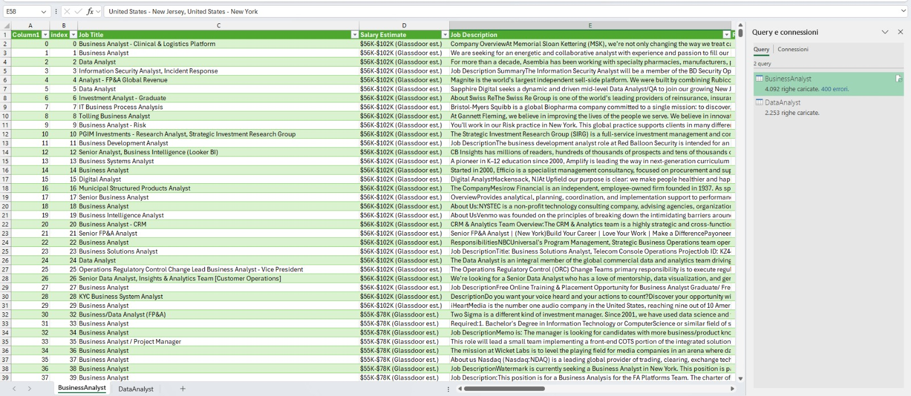
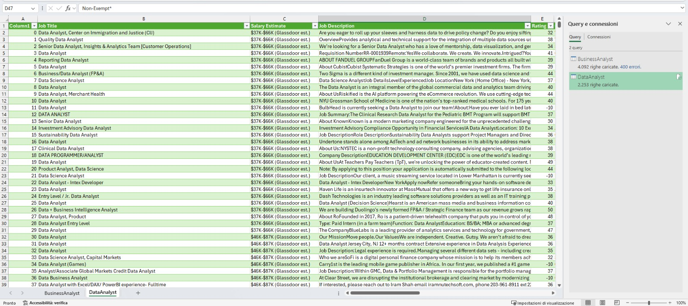

Pivot Tables to identify top locations and patterns:

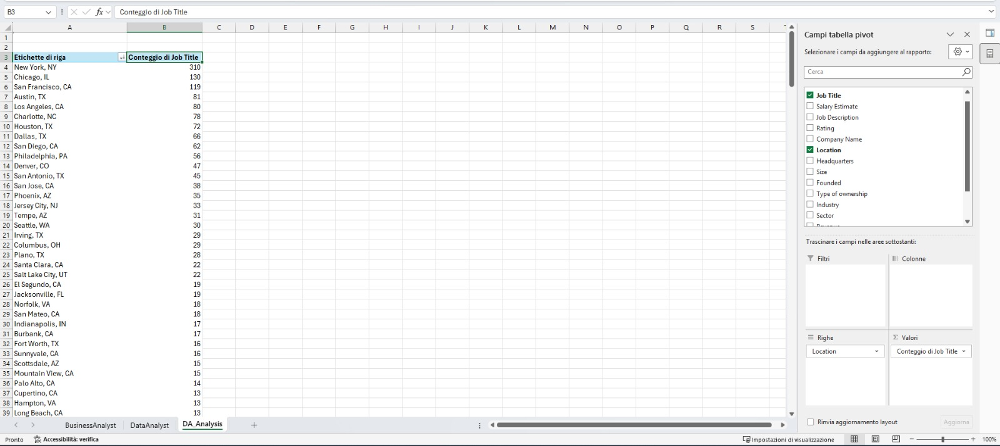

Data quality insights documented for the cleaning phase:

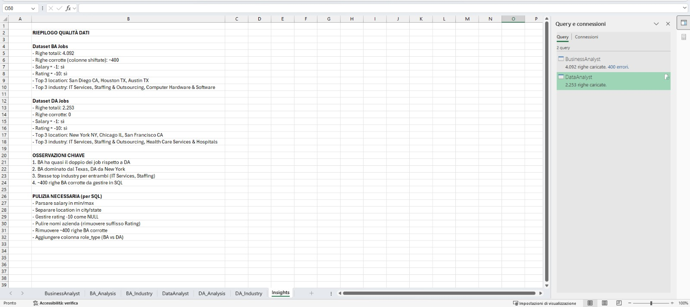

### Phase 2: MySQL — Data Cleaning & Analytics

CSV import and validation of both datasets:

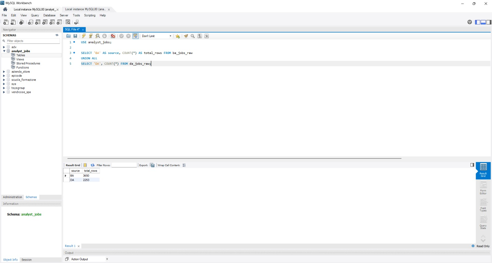

### Phase 3: Power BI — Data Model

Star schema built in Power Query with proper dimensional modeling:

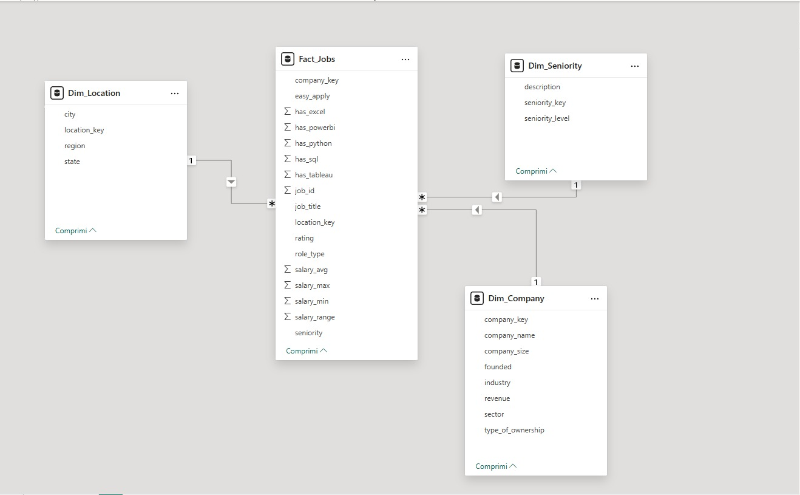

---

## 📊 Dashboard Pages

### 🏠 Home — Navigation
Interactive home page with visual navigation to all dashboard sections.

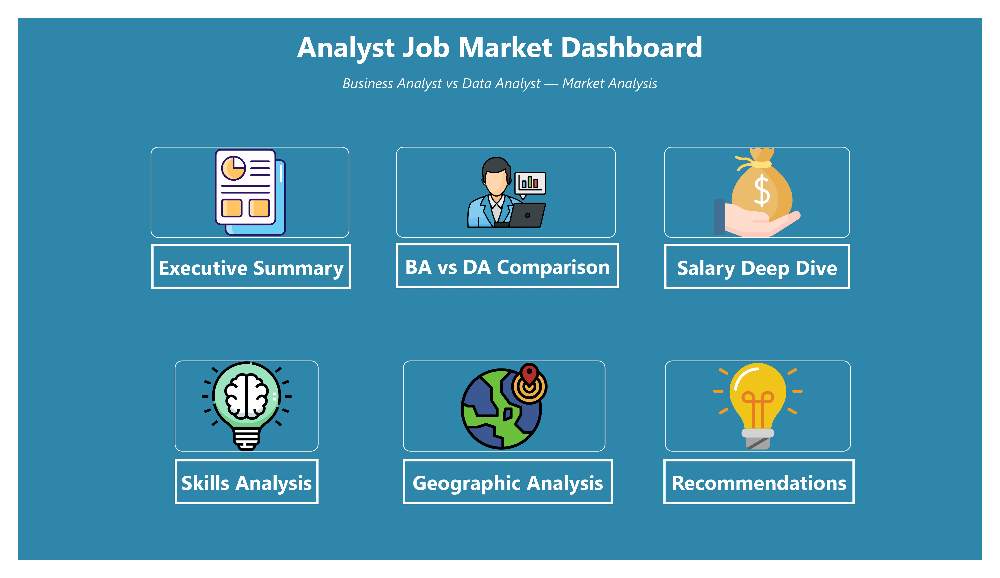

### 1️⃣ Executive Summary
High-level KPIs for decision makers: 5,901 jobs, 3,049 companies, market split, top industries and hiring companies.

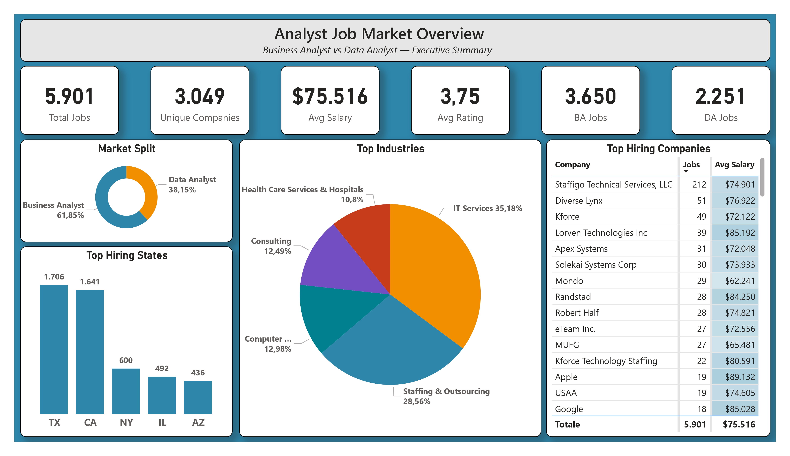

### 2️⃣ BA vs DA Comparison
Side-by-side salary comparison by state and skills demand breakdown by role.

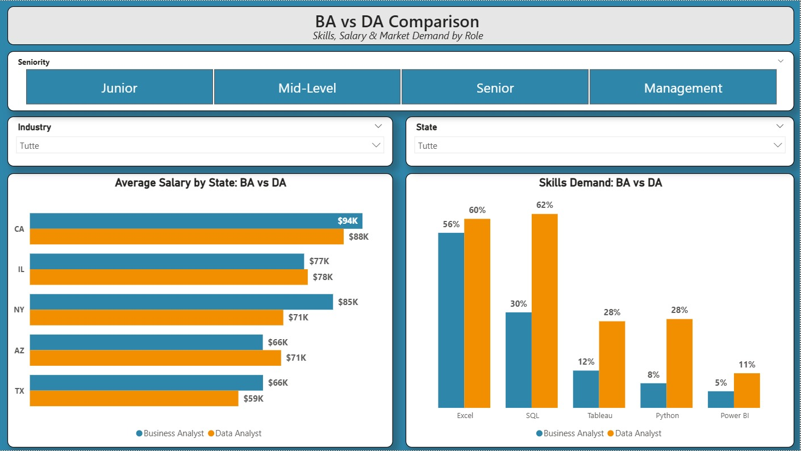

### 3️⃣ Salary Deep Dive
Salary progression by experience level, state-by-seniority matrix, and key salary statistics.

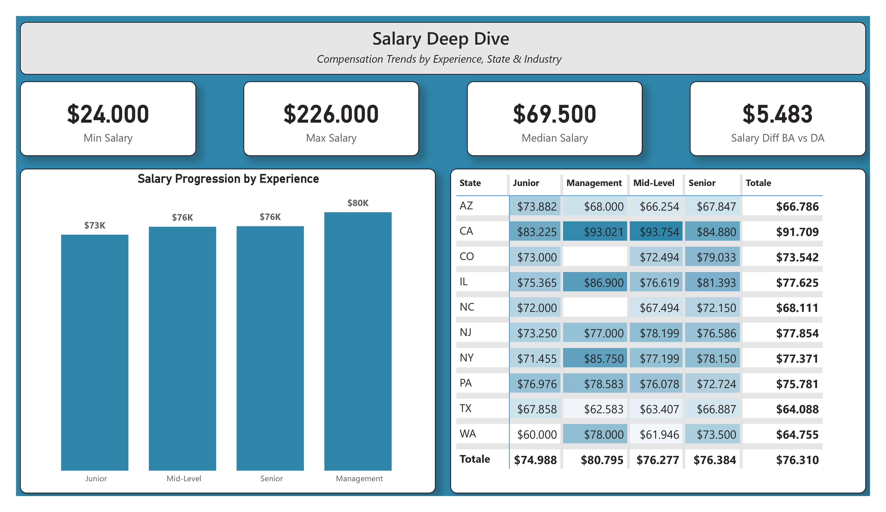

### 4️⃣ Skills Analysis
Most in-demand skills ranking, BA vs DA skills gap, and skills demand by industry matrix with conditional formatting.

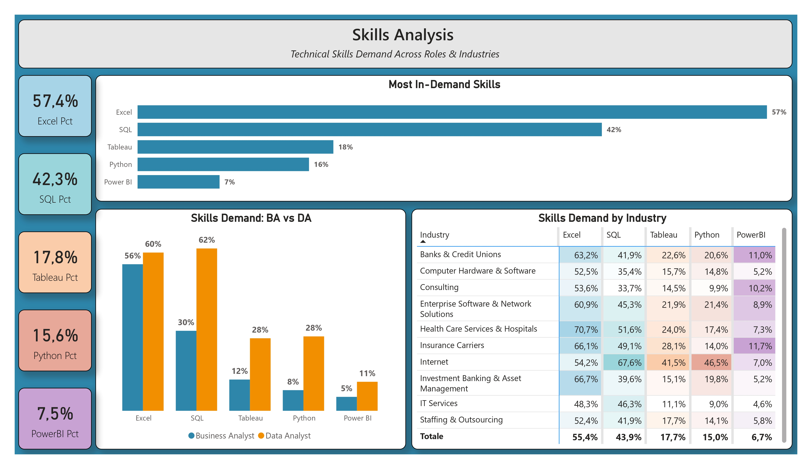

### 5️⃣ Geographic Analysis
USA map visualization, state details with BA/DA breakdown, top 10 cities, and regional overview.

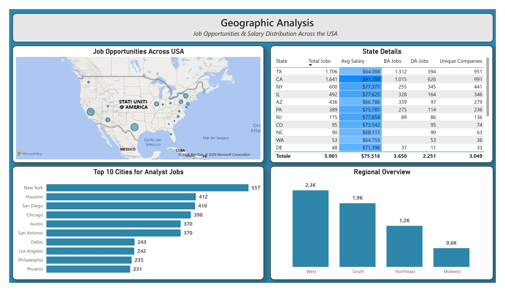

### 6️⃣ Recommendations
Data-driven career advice: career path decision, skills prioritization, and geographic strategy.

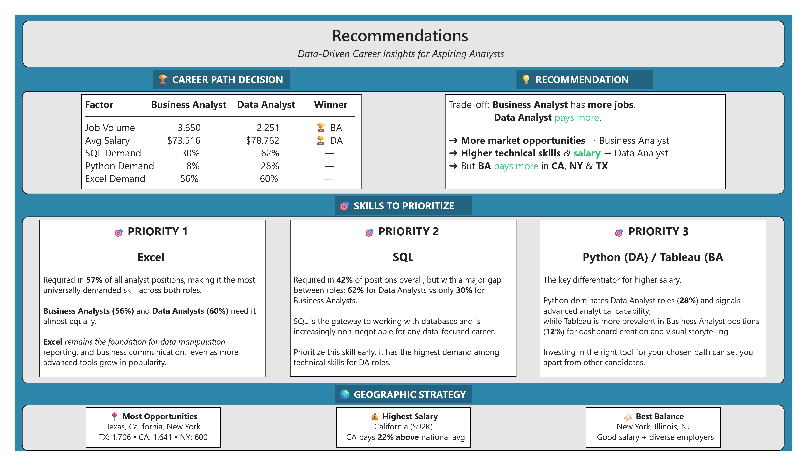

---

## 🗄️ Data Model (Star Schema)

```
                    ┌─────────────────┐
                    │   Fact_Jobs     │
                    │─────────────────│
                    │ job_id (PK)     │
                    │ salary_min      │
                    │ salary_max      │
                    │ salary_avg      │
                    │ rating          │
                    │ company_key (FK)│
                    │ location_key(FK)│
                    │ role_type       │
                    │ seniority       │
                    │ has_sql         │
                    │ has_python      │
                    │ has_excel       │
                    │ has_tableau     │
                    │ has_powerbi     │
                    └────────┬────────┘
           ┌─────────────────┼─────────────────┐
           │                 │                 │
    ┌──────▼──────┐   ┌──────▼──────┐   ┌──────▼──────┐
    │ Dim_Company │   │Dim_Location │   │Dim_Seniority│
    │─────────────│   │─────────────│   │─────────────│
    │ company_key │   │location_key │   │seniority_key│
    │ company_name│   │ city        │   │ level       │
    │ industry    │   │ state       │   │ description │
    │ sector      │   │ region      │   └─────────────┘
    │ size        │   └─────────────┘
    │ revenue     │
    └─────────────┘
```

---

## 📁 Project Structure

```
01-Job-Market-Analysis/
├── README.md
├── data/
│   ├── BusinessAnalyst.csv          # Raw BA dataset (~135K rows)
│   ├── DataAnalyst.csv              # Raw DA dataset (~73.5K rows)
│   └── jobs_export.csv              # Cleaned & combined export for Power BI
├── excel/
│   └── Jobs_Exploration.xlsx        # Exploratory analysis with Pivot Tables
├── sql/
│   ├── import_all_data.sql          # Table creation & CSV import scripts
│   └── queries.sql                  # All analytical queries
├── powerbi/
│   ├── Analyst_Job_Market_Dashboard.pbix
│   └── Analyst_Job_Market_Dashboard.pdf
└── screenshots/                     # Full pipeline documentation (13 images)
```

---

## 🔍 SQL Highlights

**UNION of two datasets with role classification:**
```sql
CREATE TABLE jobs_combined AS
SELECT *, 'Business Analyst' AS role_type FROM ba_jobs_raw
UNION ALL
SELECT *, 'Data Analyst' AS role_type FROM da_jobs_raw;
```

**Salary parsing from messy string format:**
```sql
-- "$56K-$102K (Glassdoor est.)" → salary_min: 56000, salary_max: 102000
CAST(REPLACE(REPLACE(
    SUBSTRING_INDEX(salary_estimate, '-', 1), '$', ''), 'K', ''
) AS UNSIGNED) * 1000 AS salary_min
```

**Skills analysis — single-pass efficiency on 209K rows:**
```sql
SELECT
    role_type,
    COUNT(*) AS sample_size,
    ROUND(SUM(CASE WHEN LOWER(job_description) LIKE '%sql%'
          THEN 1 ELSE 0 END) * 100.0 / COUNT(*), 1) AS sql_pct,
    ROUND(SUM(CASE WHEN LOWER(job_description) LIKE '%python%'
          THEN 1 ELSE 0 END) * 100.0 / COUNT(*), 1) AS python_pct,
    ROUND(SUM(CASE WHEN LOWER(job_description) LIKE '%excel%'
          THEN 1 ELSE 0 END) * 100.0 / COUNT(*), 1) AS excel_pct
FROM jobs_analysis
GROUP BY role_type;
```

**Company salary ranking with Window Functions:**
```sql
WITH company_stats AS (
    SELECT company_name_clean, industry,
           COUNT(*) AS job_count,
           ROUND(AVG(salary_avg), 0) AS avg_salary
    FROM jobs_analysis
    GROUP BY company_name_clean, industry
    HAVING job_count >= 5
)
SELECT *,
    RANK() OVER (PARTITION BY industry ORDER BY avg_salary DESC) AS salary_rank
FROM company_stats;
```

---

## 📊 DAX Highlights

```dax
// Role-specific measures
BA Avg Salary = CALCULATE([Avg Salary], Fact_Jobs[role_type] = "Business Analyst")
DA Avg Salary = CALCULATE([Avg Salary], Fact_Jobs[role_type] = "Data Analyst")

// Dynamic skills analysis using SWITCH pattern
Skill Job Count =
SWITCH(
    SELECTEDVALUE(Skills[Skill]),
    "SQL", [SQL Jobs],
    "Python", [Python Jobs],
    "Excel", [Excel Jobs],
    "Tableau", [Tableau Jobs],
    "Power BI", [PowerBI Jobs],
    BLANK()
)

// Automated career recommendation
Career Recommendation =
VAR SalaryWinner = [BA vs DA Salary Winner]
VAR JobsWinner = [BA vs DA Jobs Winner]
RETURN
IF(SalaryWinner = JobsWinner,
    SalaryWinner & " offers both more jobs and higher salary",
    "Trade-off: " & JobsWinner & " has more jobs, " & SalaryWinner & " pays more")
```

---

## 📦 Dataset

| Dataset | Rows | Source |
|---------|------|--------|
| Business Analyst Jobs | ~135,000 | [Kaggle](https://www.kaggle.com/datasets/andrewmvd/business-analyst-jobs) |
| Data Analyst Jobs | ~73,500 | [Kaggle](https://www.kaggle.com/datasets/andrewmvd/data-analyst-jobs) |
| **Combined (after cleaning)** | **5,901** | Filtered for valid salary data |

---

## 💡 Recommendations (from the data)

1. **Career Path:** BA has more jobs, DA pays more — it's a trade-off based on your priorities.
2. **Skills Priority:** Excel first (57%), SQL second (42%), then Python or Tableau as differentiators.
3. **Geographic Strategy:** California for highest salary ($92K), Texas for most opportunities (1,706 jobs), New York & Illinois for best balance of salary and employer diversity.

---

## 👤 Author

**Jonathan Santhanam**
- 📧 jonathan.santhanam@gmail.com
- 💼 [LinkedIn](https://www.linkedin.com/in/jonathan-santhanam/)
- 🐙 [GitHub](https://github.com/JonathanSanthanam)
