# 💰 The Profit Machine — Financial KPI Dashboard

A full financial P&L dashboard analyzing **$117.9M in revenue** across 5 countries, 5 customer segments, and 6 products — covering profit margin analysis, budget variance, pricing strategy, and CFO-ready executive summary.

**Full pipeline:** Raw files → Excel exploration → MySQL cleaning & analytics → Power BI interactive dashboard

---

## 🎯 Business Question

*"Which segments and countries are actually profitable? Where does margin go? Are we hitting budget?"*

This project answers these questions with data, transforming raw financial records into a 7-page interactive dashboard designed for executive decision-making.

---

## 📈 Key Findings

| Metric | Value |
|--------|:-----:|
| **Net Revenue** | $117.9M |
| **Total Profit** | $16.9M |
| **Profit Margin** | 14.3% |
| **YoY Growth** | +246% |
| **Budget Variance** | +$5.5M (+1.5%) |

**Highlights:**
- 🏆 **Government drives 67% of total profit** — the most valuable segment by far
- 💥 **Enterprise is the only segment with negative margin (-3.3%)** — a clear red flag
- 💸 **COGS is the main margin killer** at 85.7% of net revenue — discounts only 7.2%
- 🇫🇷 **France leads in absolute profit** at $3.8M, followed by Germany ($3.7M)
- 🎯 **Amarilla is the top product** at 16% profit margin
- 📋 **Forecast is more accurate than the original budget** across all departments

---

## 🛠️ Tech Stack & Pipeline
```
Excel (Exploration) → MySQL (Cleaning & Analytics) → Power BI (Dashboard)
```

| Tool | What I Did |
|------|------------|
| **Excel** | Data exploration, Pivot Tables for validation, P&L consistency checks, pricing strategy analysis |
| **MySQL 8.0** | Data cleaning, calculated columns (profit_margin_pct, cogs_ratio_pct, price_premium), CTEs, Window Functions, What-If simulation, Views |
| **Power BI** | Star schema data model in Power Query, 20+ DAX measures, 7-page interactive dashboard with drill-through |

---

## 📂 Process Walkthrough

### Phase 1: Excel — Data Exploration

Data quality checks — zero NULL values confirmed:

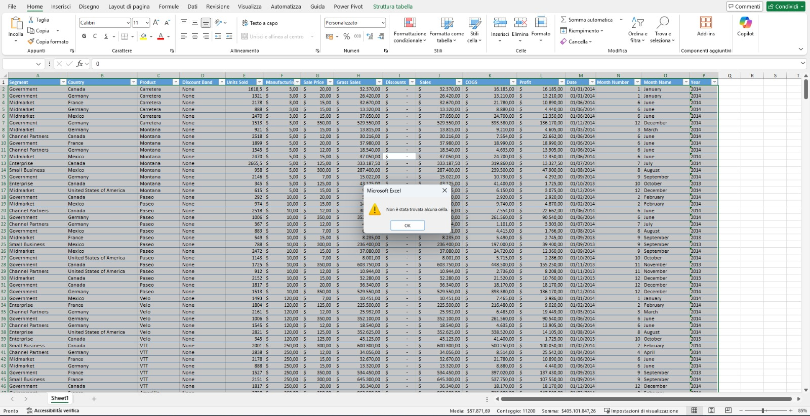

P&L consistency check (Profit = Sales - COGS verified):

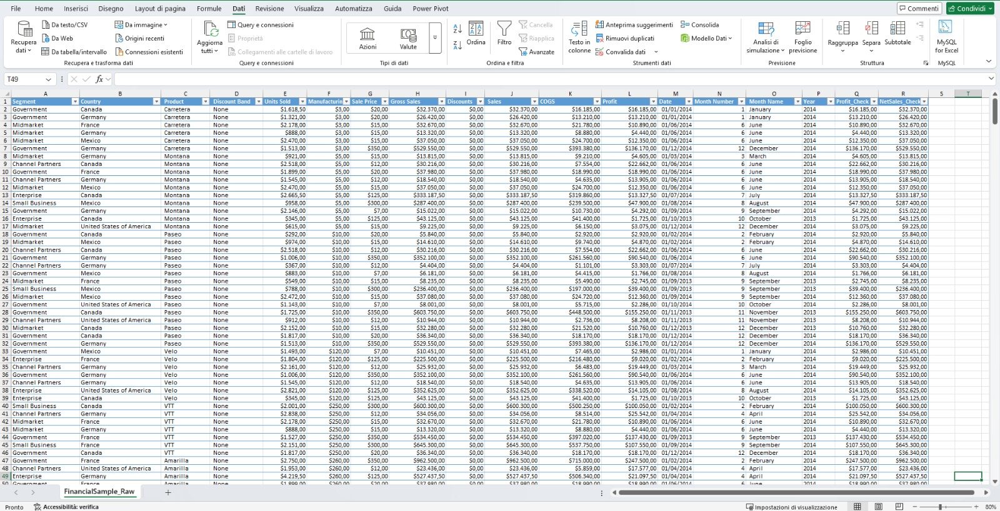

Profit and margin by customer segment:

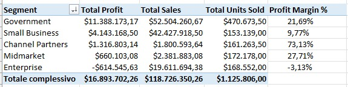

Profit by product × discount band:

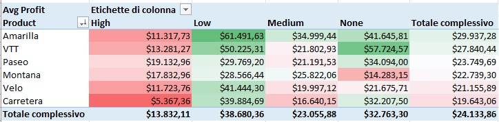

Monthly sales trend 2013 vs 2014:

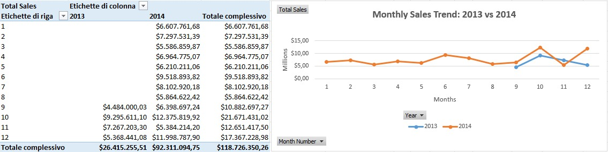

Revenue and margin by country:

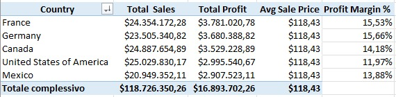

COGS ratio per product:

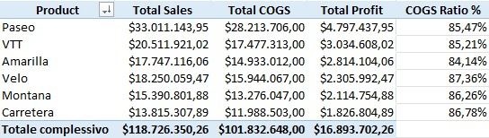

Price premium analysis per product:

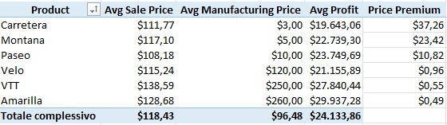

Budget variance by department:

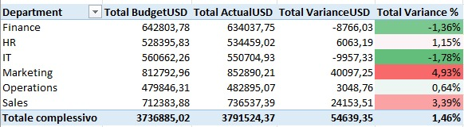

Forecast vs budget accuracy:

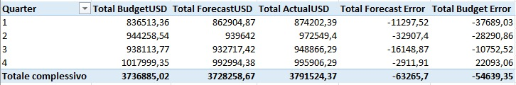

Variance heatmap dept × quarter:

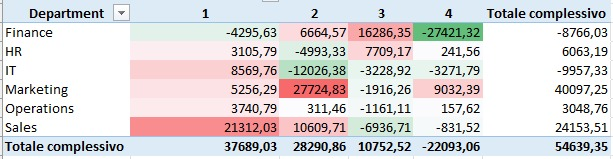

---

## 📊 Dashboard Pages

### 🏠 Home — Navigation
Interactive home page with visual navigation to all dashboard sections.


### 1️⃣ Command Center
P&L Waterfall (Gross Sales → Discounts → COGS → Profit), monthly trend 2013 vs 2014, and 5 KPI cards.


### 2️⃣ Where We Win
Revenue vs Margin scatter by segment, profit by country bar chart, and Segment × Country heatmap.


### 3️⃣ The Cost Story
COGS vs Discounts breakdown by product, discount impact by segment, and margin trend with benchmark line.


### 4️⃣ Budget Reality Check
Budget vs Forecast vs Actual by quarter, variance by department, and heatmap Dept × Quarter.


### 5️⃣ Pricing Power
Price premium vs margin scatter, optimal discount band per product, and full pricing strategy breakdown.


### 6️⃣ CFO Briefing
Executive summary with key numbers, business story, and 3 actionable recommendations.


---

## 🗄️ Data Model (Star Schema)
```
                    ┌─────────────────┐
                    │   Fact_Sales    │
                    │─────────────────│
                    │ sale_id (PK)    │
                    │ product_key(FK) │
                    │ segment_key(FK) │
                    │ country_key(FK) │
                    │ units_sold      │
                    │ gross_sales     │
                    │ discounts       │
                    │ sales           │
                    │ cogs            │
                    │ profit          │
                    │ profit_margin   │
                    │ price_premium   │
                    └────────┬────────┘
           ┌─────────────────┼─────────────────┐
           │                 │                 │
    ┌──────▼──────┐   ┌──────▼──────┐   ┌──────▼──────┐
    │ Dim_Product │   │ Dim_Segment │   │ Dim_Country │
    │─────────────│   │─────────────│   │─────────────│
    │ product_key │   │ segment_key │   │ country_key │
    │ product     │   │ segment     │   │ country     │
    │ discount_   │   │ segment_    │   └─────────────┘
    │ band        │   │ type        │
    └─────────────┘   └─────────────┘

    Standalone table (no relationship to Fact_Sales):
    ┌─────────────────┐
    │   Fact_Budget   │
    │─────────────────│
    │ dept            │
    │ quarter         │
    │ budget_usd      │
    │ forecast_usd    │
    │ actual_usd      │
    │ variance_usd    │
    │ variance_flag   │
    └─────────────────┘
```

---

## 📁 Project Structure
```
02-Financial_KPI_Dashboard/
├── README.md
├── data/
│   ├── raw/                        # Original source files
│   │   ├── Financial Sample.xlsx
│   │   ├── financial_sample.csv
│   │   ├── Budget-Forecast.xlsx
│   │   ├── budget_forecast.csv
│   │   └── P2_Exploration.xlsx     # Excel workbook with pivot tables
│   └── cleaned/                    # Exported from MySQL, ready for Power BI
│       ├── financial_export.csv
│       └── budget_export.csv
├── sql/
│   └── P2_queries.sql              # Full MySQL pipeline
├── screenshots/                    # Excel data quality checks and pivot tables (11 images)
├── powerbi/                        # Dashboard pages as PDF + .pbix file
│   ├── 01_Home.pdf
│   ├── ...
│   └── P2_Financial_KPI_Dashboard.pbix
└── Project 2 done!.pdf             # Full dashboard export (all pages)
```

---

## 🔍 SQL Highlights

**Data quality verification — P&L consistency check:**
```sql
SELECT
    COUNT(*) AS total_rows,
    SUM(CASE WHEN ABS(profit - (sales - cogs)) > 0.01 THEN 1 ELSE 0 END) AS pl_errors
FROM financial_raw;
-- Result: pl_errors = 0 ✓
```

**Pricing strategy — which discount band maximizes margin per product?**
```sql
WITH product_pricing AS (
    SELECT product, discount_band,
           ROUND(AVG(profit_margin_pct), 2) AS avg_margin_pct,
           RANK() OVER (PARTITION BY product ORDER BY AVG(profit_margin_pct) DESC) AS rk
    FROM financial_clean
    GROUP BY product, discount_band
)
SELECT product, discount_band, avg_margin_pct
FROM product_pricing
WHERE rk = 1;
```

**What-If simulation — budget cut impact on surplus departments:**
```sql
SELECT dept,
    total_budget,
    CASE WHEN variance_pct > 0 THEN ROUND(total_budget * 0.90, 0)
         ELSE total_budget END AS simulated_budget,
    CASE WHEN variance_pct > 0 THEN ROUND(total_actual - (total_budget * 0.90), 0)
         ELSE total_variance END AS simulated_variance
FROM dept_summary;
```

---

## 📊 DAX Highlights
```dax
// P&L measures
Profit Margin % = DIVIDE([Total Profit], [Total Sales], 0)
COGS Ratio % = DIVIDE([Total COGS], [Total Sales], 0)
YoY Growth % = DIVIDE([Sales 2014] - [Sales 2013], [Sales 2013], 0)

// Dynamic text for executive summary
Top Segment =
CALCULATE(
    FIRSTNONBLANK(Dim_Segment[segment], 1),
    TOPN(1, ALL(Dim_Segment[segment]), [Total Profit], DESC)
)

// Margin status indicator
Margin Status =
IF([Profit Margin %] >= 0.15, "Strong ▲",
IF([Profit Margin %] >= 0.05, "Moderate →", "Weak ▼"))
```

---

## 📦 Dataset

| Dataset | Rows | Source |
|---------|------|--------|
| Microsoft Financial Sample | 700 | [Microsoft / Power BI](https://learn.microsoft.com/en-us/power-bi/create-reports/sample-financial-download) |
| ExcelX Budget Forecast | 48 | [ExcelX](https://excelx.com/practice-data/finance-accounting/) |

---

## 💡 Recommendations (from the data)

1. **Segment Strategy:** Drop or restructure Enterprise — it's the only segment losing money (-3.3% margin). Double down on Government and Channel Partners.
2. **Cost Focus:** COGS at 85.7% is the real problem, not discounts. Margin improvement needs to come from the cost side.
3. **Pricing:** Avoid High Discount band on low-margin products — the data shows it doesn't drive enough volume to compensate.

---

## 👤 Author

**Jonathan Santhanam**
- 📧 jonathan.santhanam@gmail.com
- 💼 [LinkedIn](https://www.linkedin.com/in/jonathan-santhanam/)
- 🐙 [GitHub](https://github.com/JonathanSanthanam)
